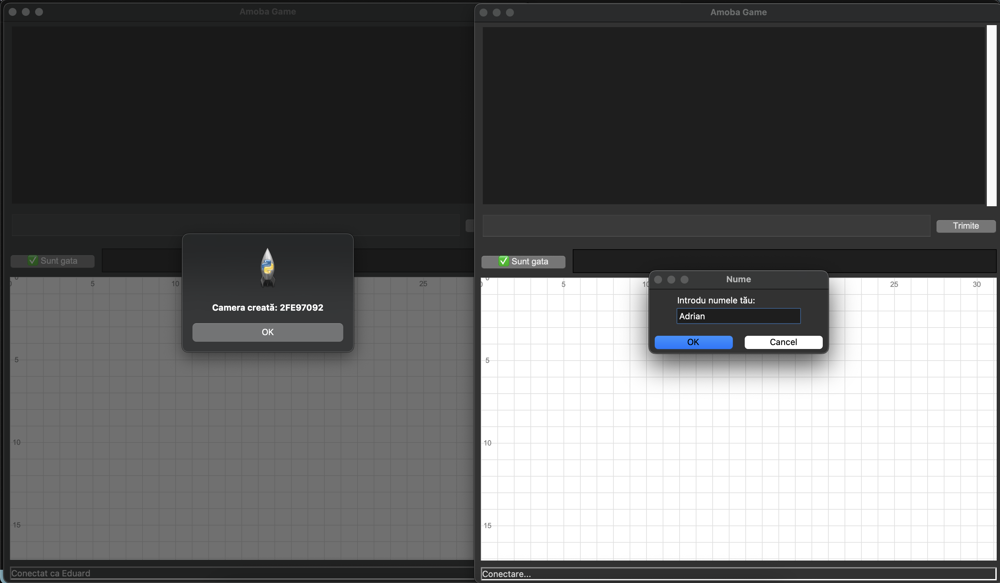
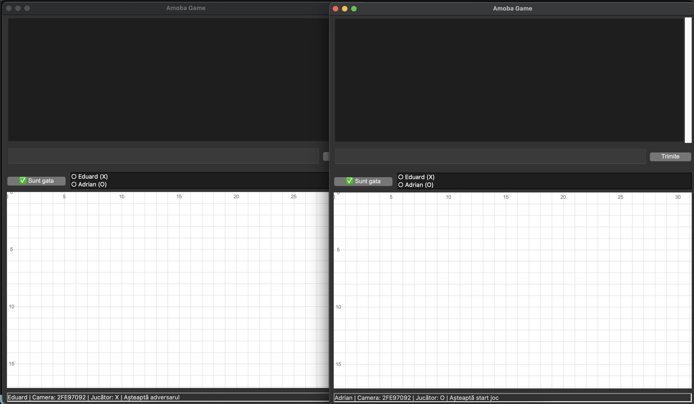
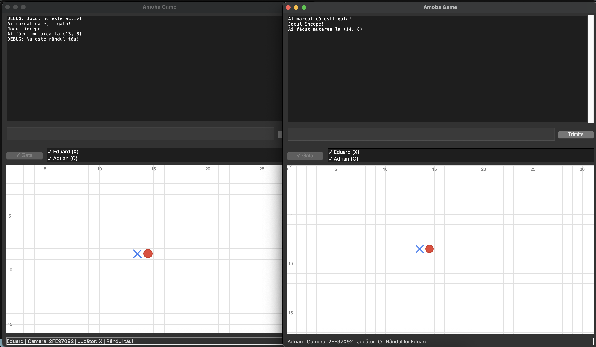
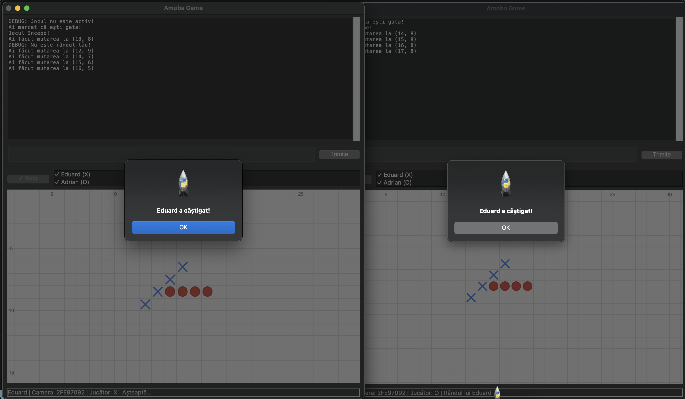

# XO Infinity - Joc de X și O Multiplayer

**XO Infinity** este un joc multiplayer de X și O care extinde jocul clasic pe un spațiu nemărginit, cu funcționalități moderne precum camere de joc, chat în timp real și un sistem de leaderboard.

## 📁 Fișiere proiect

- `server.py` - Implementarea serverului central de joc prin comunicare TCP.
- `client.py` - Interfața grafică a clientului și logica de conectare.
- `models.py` - Modelele de date (camere de joc, jucători, simboluri).
- `game_logic.py` - Logica jocului: reguli, verificare câștigător, actualizare tablă.
- `network.py` - Comunicare rețea între client și server.
- `requirements.txt` - Lista dependențelor necesare.

## 🕹️ Funcționalități cheie

- **Joc clasic X și O** extins pe o tablă infinită.
- **2 jucători/cameră** cu simboluri X și O.
- **Scopul jocului:** Aliniază 5 simboluri consecutiv (orizontal, vertical, diagonal).
- **Camere multiple:** Suport pentru mai multe jocuri simultane.
- **Leaderboard:** Urmărirea scorurilor jucătorilor.
- **Chat în timp real** în cadrul fiecărei camere.

## 🧠 Tehnologii și structuri

### 🔸 Structuri de date
- `Dicționare` pentru camerele de joc
- `Enum` pentru simbolurile jucătorilor
- `@dataclass` pentru modelul camerei de joc
- `Tuple` pentru coordonatele pe tablă

### 🔸 Comunicare în rețea
- Protocol TCP cu socket-uri Python
- Conexiuni multiple gestionate asincron
- Serializarea datelor între client și server cu JSON

### 🔸 Interfață grafică
- **Tkinter** pentru afișarea tablei și interacțiunea jucătorului
- Suport pentru creare și alăturare la camere de joc

## 📸 Capturi de ecran

- **Ecran principal client** (cu opțiuni de creare/join)
- **Tablă de joc** (în timpul unei partide)
- **Mesaje de câștig și chat în timp real**
- **Leaderboard**

